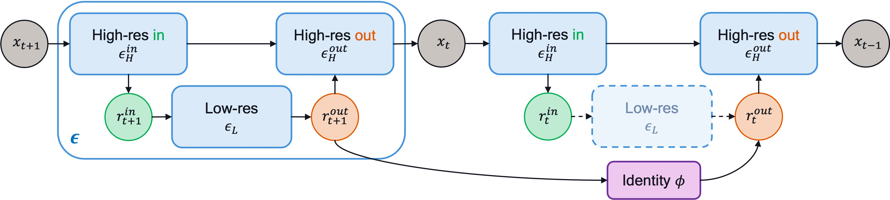
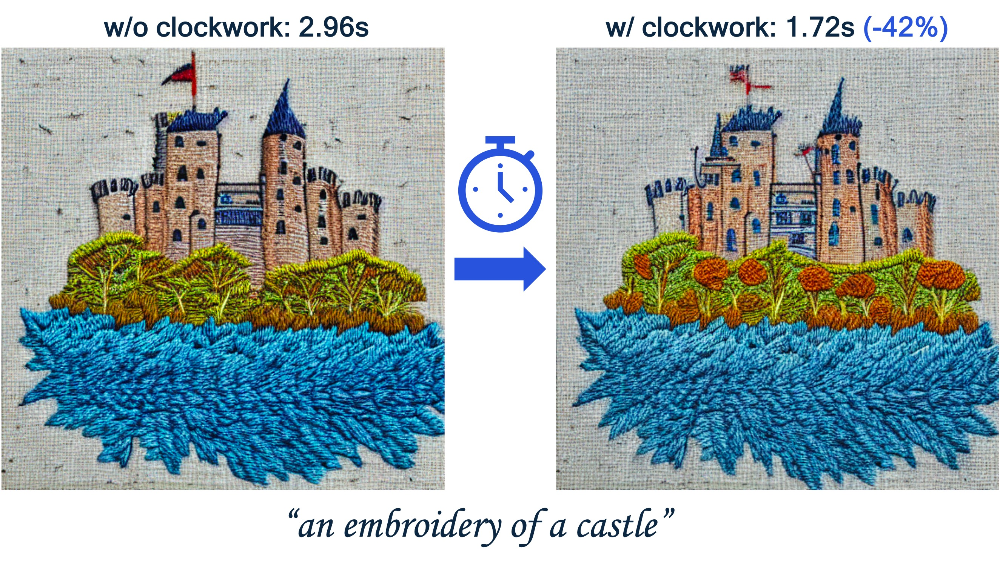

# Clockwork Diffusion: Efficient Generation With Model-Step Distillation

[arxiv](https://arxiv.org/abs/2312.08128)
[twitter](https://twitter.com/amir_habibian/status/1742574439122833804)

> This work aims to improve the efficiency of text-to-image diffusion models.
> While diffusion models use computationally expensive UNet-based denoising operations
> in every generation step, we identify that not all operations are equally
> relevant for the final output quality. In particular, we observe that UNet
> layers operating on high-res feature maps are relatively sensitive to small
> perturbations. In contrast, low-res feature maps influence the semantic layout
> of the final image and can often be perturbed with no noticeable change in the output.
> Based on this observation, we propose _Clockwork Diffusion_, a method that
> periodically reuses computation from preceding denoising steps to approximate
> low-res feature maps at one or more subsequent steps. For multiple baselines,
> and for both text-to-image generation and image editing, we demonstrate that
> Clockwork leads to comparable or improved perceptual scores with drastically
> reduced computational complexity. As an example, for Stable Diffusion v1.5
> with 8 DPM++ steps we save 32% of FLOPs with negligible FID and CLIP change.


This is a reference implementation for Clockwork Diffusion identity adaptor.
It allows up to 40% wallclock time savings with close to no loss in perceptual
quality without any finetuning required (under certain condition). Add a single
line to your pipeline synthesis code and see for yourself!

1. [Setup](#setup)
1. [Repo Structure](#repo-structure)
1. [Run Clockwork](#run-clockwork)
1. [Run Dockerised Notebook Examples](#run-dockerised-notebook-examples)
1. [Run Clockwork](#run-clockwork)
1. [Citation](#citation)




## 1. Setup

Create the environment and install the dependencies by running:

```
git clone git@github.com/Qualcomm-AI-research/clockwork-diffusion.git
cd clockwork-diffusion
```

### Using conda

The following assumes conda is installed on your machine:

```
conda create -n clockwork python=3.9
conda activate clockwork
pip install .
```

### Using virtualenv

The following assumes python 3.9 is installed on your machine:

```
python3.9 -m venv .venv
source .venv/bin/activate
pip install .
```

## 2. Repo Structure

```
.
├── README.md
├── clockwork
│   ├── __init__.py
│   ├── _version.py
│   └── base.py
├── docker
│   ├── Dockerfile
│   └── requirements.txt
├── images
│   └── architecture.jpg
│   └── teaser.jpg
├── notebooks
│   └── clockwork_example.ipynb
├── setup.py
└── tests
    ├── __init__.py
    └── test_base.py
```

## 3. Run Clockwork

Use the clockwork wrapper on top of stable diffusion and
save up to 40% wallclock time with close to no loss in perceptual quality
without any finetuning required! The below example demonstrates this for Stable Diffusion
1.5 and DDIM scheduler with 50 steps to match the settings in the paper, but feel
free to play around with different versions and schedulers.

```python
import torch

from clockwork import ClockworkWrapper
from diffusers import DDIMScheduler, StableDiffusionPipeline


MODEL_ID = "runwayml/stable-diffusion-v1-5"
pipeline = StableDiffusionPipeline.from_pretrained(
    MODEL_ID,
    torch_dtype=torch.float16,
)
pipeline = pipeline.to("cuda")
pipeline.scheduler = DDIMScheduler.from_pretrained(MODEL_ID, subfolder="scheduler")
pipeline.scheduler.set_timesteps(50, device="cuda")

# NOTE: wrapping Unet with clockwork wrapper, only new line required for it to work
pipeline.unet = ClockworkWrapper(pipeline.unet, clock=4)

PROMPT = "an embroidery of a castle"
image = pipeline(
    PROMPT,
    generator=torch.Generator(device="cuda").manual_seed(174785024),
    guidance_scale=7.5,
).images[0]  

pipeline.unet.reset()  # NOTE: reset clock to zero for the next pipeline call
```

To see the above example in action, please skim through
[the provided notebook](notebooks/clockwork_example.ipynb) which showcases
40% wallclock time improvement for similar perceptual quality compared to
the regular Stable Diffusion pipeline without clockwork.

## 4. Run Dockerised notebook examples

The provided notebook can be ran in standalone fashion through `conda` or `venv`, but we also provide
a Dockerised implementation. The provided images brings in the necessary system dependencies and python packages
to use the system, and also executes the test suite to ensure the package's behavior. The image can be built using
the following command, where the port build argument needs to be defined.
```
docker build --build-arg PORT=<PORT> -f docker/Dockerfile --tag clockwork_diffusion:latest .
```

And then a container can be ran using the following, mapping the ports between container and host machine:
```
docker run -p <PORT>:<PORT> clockwork_diffusion:latest
```
The address/tokens for the notebook will then become available in the terminal window where the above command
was executed.

## 5. Run Tests

The following command runs the unit test suite for the clockwork package:

```
pip install pytest
pytest tests
```

## 6. Citation

```
@misc{habibian2023clockwork,
    title={Clockwork Diffusion: Efficient Generation With Model-Step Distillation},
    author={Amirhossein Habibian and Amir Ghodrati and Noor Fathima and Guillaume Sautiere and Risheek Garrepalli and Fatih Porikli and Jens Petersen},
    year={2023},
    eprint={2312.08128},
    archivePrefix={arXiv},
    primaryClass={cs.CV}
}
```
